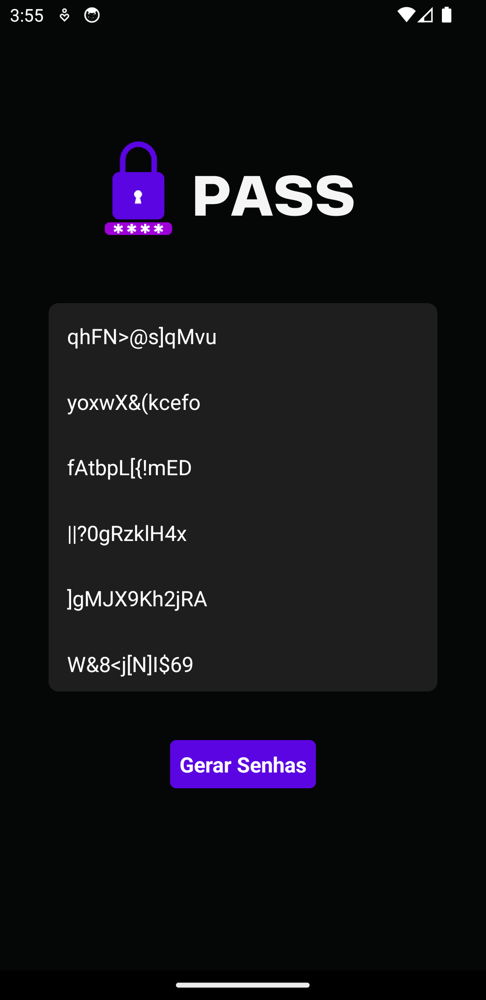

# Gerador de Senhas em React Native

Este é um projeto simples de um gerador de senhas criado usando React Native e Expo. O aplicativo gera uma lista de senhas aleatórias e permite que o usuário copie uma senha específica para a área de transferência.

## Capturas de Tela

<div style="display: flex;">
    
    
    
    
</div>

## Funcionalidades

- Geração de senhas aleatórias de 12 caracteres
- Exibição de 10 senhas geradas
- Copiar senha para a área de transferência ao clicar na senha

## Instalação

Para clonar e executar este aplicativo, você precisará do [Git](https://git-scm.com), [Node.js](https://nodejs.org/en/), e [Expo CLI](https://docs.expo.dev/get-started/installation/) instalados em seu computador. A partir da linha de comando:

```bash
# Clone este repositório
$ git clone https://github.com/devraulbraga/app-gerar-senha

# Acesse a pasta do projeto
$ cd app-gerar-senha

# Instale as dependências
$ npm install

# Inicie o projeto
$ expo start
